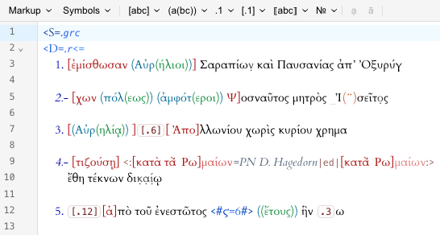
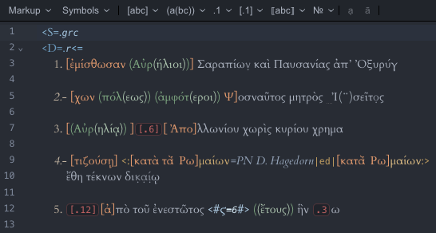

# leiden-js

A set of packages for working with Leiden notation systems used in digital epigraphy within JavaScript environments,
with a focus on [CodeMirror](https://codemirror.net/) editor integration. Supports
[Leiden+](https://papyri.info/docs/leiden_plus) and
[Leiden Translation](https://papyri.info/docs/leiden_plus_translation) variants as used on
[papyri.info](https://papyri.info), providing syntax highlighting, basic linting, toolbars, and
transformations between Leiden notation and EpiDoc XML.

 

See it in action: https://cceh.github.io/leiden-js/

## Usage

To quickly set up a Leiden+ editor pre-configured with syntax highlighting, linting, and an editing toolbar, use the
`codemirror-leiden-plus` convenience package:

```javascript
import {EditorView} from "@codemirror/view";
import {leidenPlus} from "@leiden-js/codemirror-leiden-plus";

const editor = new EditorView({
    extensions: [
        leidenPlus() // Already includes necessary editor extensions
    ],
    parent: document.querySelector("#editor")
});
```

> **Note**: The convenience packages (`codemirror-leiden-*`) already include a subset of CodeMirror's
> [basicSetup](https://github.com/codemirror/basic-setup). Prefer not to use `basicSetup()` as some of the included
> extensions do not work well together with the Leiden extensions.

## Standalone Packages

While most packages are designed to work within a CodeMirror editor environment, several packages can be used
independently:

- **Parser packages** for parsing Leiden notation into a syntax tree
- **Transformer packages** for conversion between Leiden and EpiDoc XML
- **Linter packages** for Leiden syntax validation

The `transformation-service` package provides an example of how to use the packages outside a CodeMirror
environment.

## Packages

The repository is organized as a `pnpm` monorepo with the following packages:

| Package                                   | Description                                                                 |
|-------------------------------------------|-----------------------------------------------------------------------------|
| `@leiden-js/codemirror-leiden-plus`       | Convenience package with pre-configured editor setup for Leiden+            |
| `@leiden-js/codemirror-leiden-trans`      | Convenience package with pre-configured editor setup for Leiden Translation |
| `@leiden-js/codemirror-lang-leiden-plus`  | Core CodeMirror language support for Leiden+                                |
| `@leiden-js/codemirror-lang-leiden-trans` | Core CodeMirror language support for Leiden Translation                     |
| `@leiden-js/parser-leiden-plus`           | Parser for Leiden+ notation                                                 |
| `@leiden-js/parser-leiden-trans`          | Parser for Leiden Translation notation                                      |
| `@leiden-js/transformer-leiden-plus`      | XML conversion for Leiden+                                                  |
| `@leiden-js/transformer-leiden-trans`     | XML conversion for Leiden Translation                                       |
| `@leiden-js/linter-leiden-plus`           | Linting for Leiden+                                                         |
| `@leiden-js/linter-leiden-trans`          | Linting for Leiden Translation                                              |
| `@leiden-js/toolbar-leiden-plus`          | Editing toolbar configuration for Leiden+                                   |
| `@leiden-js/toolbar-leiden-trans`         | Editing toolbar configuration for Leiden Translation                        |
| `@leiden-js/ui-toolbar`                   | Configurable editing toolbar for CodeMirror                                 |
| `@leiden-js/transformation-service`       | JSON API service for transformation between Leiden and XML                  |
| `@leiden-js/common`                       | Shared utilities and components                                             |

## Installation

Packages can be installed individually:

```bash
npm install @leiden-js/codemirror-leiden-plus
# or
yarn add @leiden-js/codemirror-leiden-plus
```

## Advanced Usage

### Configuring the Top Node

The `topNode` determines which grammar rule the parsers use as their entry point, i.e., what kind of Leiden content is
valid.

The default top node is `Document`, which expects a full document consisting of, for Leiden+, a header `<S=.lang`,
followed by a sequence of Divs (`<D= ... =D>`) or Abs (`<= =>`,
see https://papyri.info/docs/leiden_plus#document-division). For Leiden Translation, it expects a sequence of
Translations in `<T= =T>` tags. If editors are not expected to enter a full document, use a top node that avoids
requiring certain document structure constructs:

#### Valid Top Nodes for Leiden+

| Top Node        | Description                                                     | Example                                                                                                                                 |
|-----------------|-----------------------------------------------------------------|:----------------------------------------------------------------------------------------------------------------------------------------|
| `Document`      | Full document with header followed by a sequence of Divs or Abs | <pre>&lt;S=.grc<br/>&lt;D=.r&lt;=<br/>  1. line of \[text] <br/>=&gt;=D&gt;<br/>&lt;D=.v&lt;=<br/>  1. line of \[text] <br/>=&gt;=D&gt; |
| `BlockContent`  | Sequence of Divs or Abs (like `Document` but without a header)  | <pre>&lt;D=.r&lt;=<br/>  1. line of \[text] <br/>=&gt;=D&gt;<br/>&lt;D=.v&lt;=<br/>  1. line of \[text] <br/>=&gt;=D&gt;                |
| `SingleDiv`     | Single division with opening and closing tags                   | <pre>&lt;D=.r&lt;=<br/>  1. line of \[text] <br/>=&gt;=D&gt;                                                                            |
| `SingleAb`      | Single Ab with opening and closing tags                         | <pre>&lt;=<br/>  1. line of \[text] <br/>=&gt;                                                                                          |
| `InlineContent` | Inline content (that would go inside Abs `<=  =>`)              | <pre>1. line of \[text]</pre>                                                                                                           |

#### Valid Top Nodes for Leiden Translation

| Top Node            | Description                                               | Example                                                                                                                                                     |
|---------------------|-----------------------------------------------------------|:------------------------------------------------------------------------------------------------------------------------------------------------------------|
| `Document`          | Sequence of Translations containing Divs or Paragraphs    | <pre>&lt;T=.en &lt;D= &lt;=<br/>  ((1)) line of 〚text〛 <br/>=&gt; =D&gt; =T&gt;<br/>&lt;T=.de &lt;D= &lt;=<br/>  ((1)) 〚Text〛zeile <br/>=&gt; =D&gt; =T&gt; |
| `SingleTranslation` | Single Translation with opening and closing tags          | <pre>&lt;T=.en &lt;D= &lt;=<br/>  ((1)) line of 〚text〛 <br/>=&gt; =D&gt; =T&gt;                                                                             |
| `BlockContent`      | Sequence of Divs or Paragraphs (content of a Translation) | <pre>&lt;D=.i.column &lt;=<br/>  First division<br/>=&gt; =D&gt;<br/>&lt;D=.ii.column &lt;=<br/>  Second division<br/>=&gt; =D&gt;</pre>                    |
| `SingleDiv`         | Single division with opening and closing tags             | <pre>&lt;D= &lt;=<br/>  ((1)) line of 〚text〛 <br/>=&gt; =D&gt;                                                                                              |
| `SingleP`           | Single Paragraph with opening and closing tags            | <pre>&lt;=<br/>  ((1)) line of 〚text〛 <br/>=&gt;                                                                                                            |
| `InlineContent`     | Inline content (that would go inside Paragraphs `<=  =>`) | <pre>((1)) line of text with /\*note*/ and &lt;terminus~la=term&gt;</pre>                                                                                   |

#### Example: Creating an Editor That Accepts Inline Content Only

```javascript
import {EditorView} from "@codemirror/view";
import {leidenPlus} from "@leiden-js/codemirror-leiden-plus";

const editor = new EditorView({
    extensions: [
        leidenPlus({
            languageConfig: {
                topNode: "InlineContent",
            }
        })
    ],
    parent: document.querySelector("#editor")
});
```

### Creating a Custom Leiden+ Editor Setup

If you need more control over the editor configuration, you can build your own setup instead of using the convenience
package:

```javascript
import {EditorView} from "@codemirror/view";
import {lineNumbers, history, drawSelection, highlightActiveLine} from "@codemirror/view";
import {defaultKeymap, historyKeymap} from "@codemirror/commands";
import {bracketMatching} from "@codemirror/language";
import {linter, lintGutter} from "@codemirror/lint";
import {leidenPlusLanguage} from "@leiden-js/codemirror-lang-leiden-plus";
import {leidenPlusLinter} from "@leiden-js/linter-leiden-plus";
import {leidenPlusToolbar} from "@leiden-js/toolbar-leiden-plus";

// Create a custom editor configuration with only the components you need
const editor = new EditorView({
    extensions: [
        // Core editor functionality (subset of basicSetup)
        lineNumbers(),
        history(),
        drawSelection(),
        highlightActiveLine(),
        bracketMatching(),
        EditorView.lineWrapping,

        // Keymaps
        defaultKeymap,
        historyKeymap,

        // Leiden functionality
        leidenPlusLanguage({topNode: "InlineContent"}), // config object is optional
        lintGutter(),
        linter(leidenPlusLinter()),
        leidenPlusToolbar()
    ],
    parent: document.querySelector("#editor")
});
```

### Converting Leiden+ to EpiDoc XML

```javascript
import {leidenPlusToXml} from "@leiden-js/transformer-leiden-plus";

const xml = leidenPlusToXml("<S=.grc <D=.r <= 1. Ἰωάννης, (υ(ἱὸς)) Ἀντωνίου => =D>");
console.log(xml);
// Output: '<div xml:lang="grc" type="edition" xml:space="preserve"> <div n="r" type="textpart"> <ab> <lb n="1"/>Ἰωάννης, <expan>υ<ex>ἱὸς</ex></expan> Ἀντωνίου </ab> </div></div>'
```

Or configure the `topNode` to allow partial inline content, for example:

```javascript
import {leidenPlusToXml} from "@leiden-js/transformer-leiden-plus";

const xml = leidenPlusToXml("1. Ἰωάννης, (υ(ἱὸς)) Ἀντωνίου", "InlineContent");
console.log(xml);
// Output: '<lb n="1"/>Ἰωάννης, <expan>υ<ex>ἱὸς</ex></expan> Ἀντωνίου'
```

### Converting EpiDoc XML to Leiden+

```javascript
import {xmlToLeidenPlus} from "@leiden-js/transformer-leiden-plus";

const leiden = xmlToLeidenPlus('<div xml:lang="grc" type="edition" xml:space="preserve"> <div n="r" type="textpart"> <ab> <lb n="1"/>Ἰωάννης, <expan>υ<ex>ἱὸς</ex></expan> Ἀντωνίου </ab> </div></div>');
console.log(leiden);
// Output: '<S=.grc <D=.r <= 1. Ἰωάννης, (υ(ἱὸς)) Ἀντωνίου => =D>'
```

Or partial EpiDoc XML:

```javascript
import {xmlToLeidenPlus} from "@leiden-js/transformer-leiden-plus";

const leiden = xmlToLeidenPlus('<lb n="1"/>Ἰωάννης, <expan>υ<ex>ἱὸς</ex></expan> Ἀντωνίου');
console.log(leiden);
// Output: '1. Ἰωάννης, (υ(ἱὸς)) Ἀντωνίου'
```

### Using the Parser (Standalone)

```javascript
import {parser} from "@leiden-js/parser-leiden-plus";
import {TreeCursor} from "@lezer/common";

// Parse Leiden+ notation
const tree = parser
    .configure({topNode: "SingleDiv"}) // Calling .configure is optional, default topNode is "Document".
    .parse("<D= <= 1. Ἰωάννης, (υ(ἱὸς)) Ἀντωνίου => =D>");

// Walk the syntax tree
function walkTree(cursor, indent = 0) {
    do {
        console.log(`${" ".repeat(indent)}${cursor.name} ${cursor.from}-${cursor.to}`);
        if (cursor.firstChild()) {
            walkTree(cursor, indent + 2);
            cursor.parent();
        }
    } while (cursor.nextSibling());
}

walkTree(tree.cursor());
```

### Using the Linter (Standalone)

```javascript
import {lintLeidenPlus} from "@leiden-js/linter-leiden-plus";
import {parser} from "@leiden-js/parser-leiden-plus";

// Text to lint
const text = "<S=.grc <D= <= 1. Ἰωάννης, (υ(ἱὸς)) Ἀντωνίου => =D>";
// Parse into a syntax tree
const syntaxTree = parser.parse(text);
// Lint the parsed text
const diagnostics = lintLeidenPlus(text, syntaxTree);

console.log(diagnostics);
// Output: Array of diagnostic objects with error information, if any
```

## Compatibility

The Leiden grammars and XML transformers are designed to be fully compatible with
[XSugar](https://github.com/papyri/xsugar), the reference implementation used by [papyri.info](https://papyri.info) for
converting between Leiden notation and EpiDoc XML.

For files that XSugar can process without errors, this implementation achieves **100% compatibility** with XSugar's
output.

### Testing Methodology

Compatibility testing uses the [leiden-js-idp-test-data](https://github.com/cceh/leiden-js-idp-test-data) repository,
which contains IDP data that has been processed through XSugar to generate roundtrip test cases that match current
XSugar output.

### Test Coverage

Based on the complete dataset from `idp.data` (commit 5004bac5edda034f1d6c5ee29975163476b35fb1):

- **Edition texts**: 68.926 total files, with 1.021 files excluded due to XSugar limitations
- **Translation texts**: 2.188 total files, with 1.362 files excluded due to XSugar limitations

### Excluded Files

Files are excluded from compatibility testing in two categories:

1. **XSugar conversion failures**: Files where XSugar fails to complete the roundtrip conversion process (parse errors
   or crashes). These are marked with `.fail` extensions in the test data containing information about the fail reason.

2. **Invalid outputs**: Files where XSugar produces malformed XML or invalid Leiden. These cases are documented with
   specific reasons in the test skip reports:

- [Edition skip report](./test/reports/idp-skip-report-edition.md)
- [Translation skip report](./test/reports/idp-skip-report-translation.md)

## Development

### Setup

```bash
# Install pnpm
npm install -g pnpm

# Clone the repository
git clone https://github.com/cceh/leiden-js.git
cd leiden-js

# Install dependencies
pnpm install

# Build all packages
pnpm build
```

### Development Server

```bash
# Start the development server
pnpm dev
```

### Testing

```bash
# Run all tests (excluding IDP tests)
pnpm test

# Run specific test suites
pnpm test:leiden-plus
pnpm test:leiden-trans

# Run IDP tests (requires Docker)
pnpm test:idp
```

## Acknowledgements

This project includes code derived from [jinn-codemirror](https://github.com/JinnElements/jinn-codemirror)
(Copyright © 2022 JinnTec GmbH).

Special thanks to Wolfgang Meier and JinnTec for providing an excellent starting point for the Leiden+ parser and
conversion code, and for making their work available under the MIT license upon request.