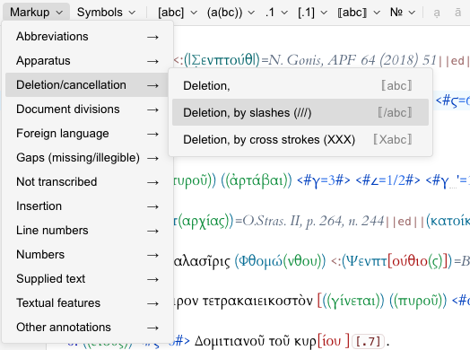

# @leiden-js/toolbar-leiden-plus

> Part of [leiden-js](https://github.com/cceh/leiden-js), a set of packages for working with the Leiden notation systems
> used in epigraphic digital editing within JavaScript environments.

Syntax-aware toolbar component for [Leiden+](https://papyri.info/docs/leiden_plus) notation editing in CodeMirror 6,
providing buttons and shortcuts for common Leiden+ markup patterns.



## Installation

```bash
npm install @leiden-js/toolbar-leiden-plus
```

## Usage

```typescript
import { leidenPlusToolbar } from "@leiden-js/toolbar-leiden-plus";
import { EditorView } from "@codemirror/view";

const view = new EditorView({
  extensions: [
    // ... other extensions
    leidenPlusToolbar
  ]
});
```

## Features

The toolbar provides quick access to common Leiden+ notation patterns including:
- Editorial brackets and markup
- Abbreviation patterns
- Numbers and special characters
- Document structure elements
- Diacritical marks and combining characters

## Related Packages

- [`@leiden-js/ui-toolbar`](https://github.com/cceh/leiden-js/tree/main/packages/ui-toolbar) - Base toolbar UI components
- [`@leiden-js/codemirror-leiden-plus`](https://github.com/cceh/leiden-js/tree/main/packages/codemirror-leiden-plus) - Complete set of editor extensions with toolbar included