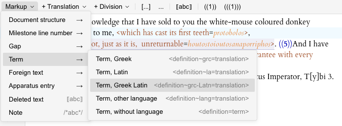

# @leiden-js/toolbar-leiden-trans

> Part of [leiden-js](https://github.com/cceh/leiden-js), a set of packages for working with the Leiden notation systems used in epigraphic digital editing within JavaScript environments.

Syntax-aware Toolbar component for [Leiden Translation](https://papyri.info/docs/leiden_plus_translation) notation
editing, providing buttons and shortcuts for common markup patterns.



## Installation

```bash
npm install @leiden-js/toolbar-leiden-trans
```

## Usage

```typescript
import { leidenTransToolbar } from "@leiden-js/toolbar-leiden-trans";
import { EditorView } from "@codemirror/view";

const view = new EditorView({
  extensions: [
    // ... other extensions
    leidenTransToolbar
  ]
});
```

## Features

The toolbar provides quick access to common Leiden Translation patterns including:
- Paragraph and division markers
- Milestone line numbers
- Foreign text markup
- Document structure elements

## Related Packages

- [`@leiden-js/ui-toolbar`](https://github.com/cceh/leiden-js/tree/main/packages/ui-toolbar) - Base toolbar UI components
- [`@leiden-js/codemirror-leiden-trans`](https://github.com/cceh/leiden-js/tree/main/packages/codemirror-leiden-trans) - Complete set of editor extensions with toolbar included